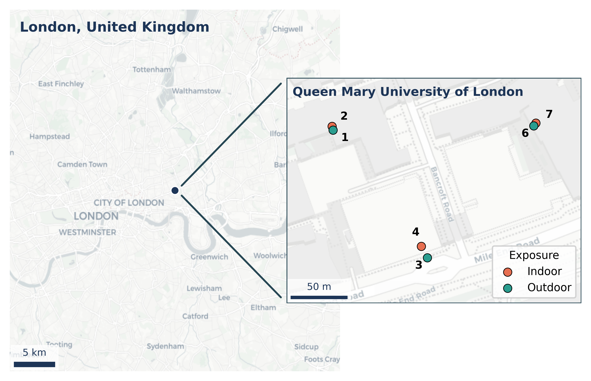

<!-- title: QM Air Quality Network -->
# QM Air Quality Network

Open hardware design and firmware for the low-cost IoT stations behind the
**QMUL Air Quality Monitoring System (AQMS)**: a seven-node network deployed
for roughly fifteen months (April 2025 to July 2026) at Queen Mary University
of London (Mile End campus) and King Edward Memorial Park, London, alongside
two Tower Hamlets reference stations.

The measurements collected by this network are published as a companion
dataset: **[qm-airquality-network-data](https://github.com/AndresMercad0/qm-airquality-network-data)**.

## What this repository contains

- `firmware/` - the station firmware: a Python acquisition stack that reads
  all sensors every 30 seconds, buffers readings locally in SQLite and
  synchronises them to an InfluxDB time-series database.
- `hardware/` - wiring diagrams and the I2C address map for a station.
- `docs/` - a map of the node positions.

## The network

| Node | Site | Exposure | Sensor tier |
|---|---|---|---|
| node_1 | QMUL, Peter Landin Building (window) | Outdoor | Low-cost |
| node_2 | QMUL, Peter Landin Building (room) | Indoor | Low-cost |
| node_3 | QMUL, Mile End Road | Outdoor (roadside) | Low + mid-cost |
| node_4 | QMUL, Engineering Building (adjacent room to Mile End Road) | Indoor | Low-cost |
| node_5 | King Edward Memorial Park (Glamis Rd & A1203) | Outdoor (roadside) | Low + mid-cost |
| node_6 | QMUL, Engineering Building then People's Palace (window) | Outdoor | Low-cost |
| node_7 | QMUL, Engineering Building then People's Palace (room) | Indoor | Low-cost |

## Station hardware

Each station is a **Raspberry Pi Zero 2 W**, mains-powered, with all sensors
on the I2C bus:

- **Low-cost tier (every node):** Sensirion SHT45 (temperature, humidity),
  Sensirion SGP40 (VOC index), Sensirion SPS30 (PM2.5, PM10), Grove
  Multichannel Gas v2 (NO2, CO), and an MQ131 ozone sensor read through an
  ADS1115 ADC.
- **Mid-cost tier (nodes 3 and 5):** Alphasense NO2-B43F, OX-B431 (ozone) and
  CO-B4 electrochemical cells on ISB boards, each read through an ADS1115.

Full wiring and the I2C address map are in
[hardware/WIRING.md](hardware/WIRING.md).

## Firmware, at a glance

The firmware (`firmware/`) samples every sensor on a fixed cycle and writes to
a local SQLite buffer, so no data is lost when connectivity drops; buffered
readings sync to InfluxDB in batches when the server is reachable. It is built
to run unattended for months: a systemd watchdog, a hardware watchdog, I2C bus
recovery and per-sensor reconnection keep a station alive through power cuts
and transient faults.

All connection settings are read from environment variables, so no
credentials or addresses are baked into the code. See
[firmware/README.md](firmware/README.md) for the high-level overview and the
variables to set. Outdoor roadside stations also carried a low-power radio link
as a backup channel; that component is not part of this public release.

## Related outputs

- Dataset: [qm-airquality-network-data](https://github.com/AndresMercad0/qm-airquality-network-data)
- Network design paper: Mercado-Velazquez, A. A., Poslad, S., &
  Escamilla-Ambrosio, P. J. (2026). *Design and Implementation of a Low-Cost
  IoT Air-Quality Monitoring Network at Queen Mary University of London Mile
  End Campus*. Smart Cities (ICSC-CITIES 2025), CCIS vol. 2742, Springer.
  https://doi.org/10.1007/978-3-032-19019-2_7

## Licence and citation

Released under the [MIT Licence](LICENSE). If you use this design or firmware
in academic work, please cite it (see [CITATION.cff](CITATION.cff)) and the
paper above.

## Contact

Andres Aharhel Mercado-Velazquez, IoT2US Lab, School of Electronic
Engineering and Computer Science, Queen Mary University of London.
a.mercadovelazquez@qmul.ac.uk
